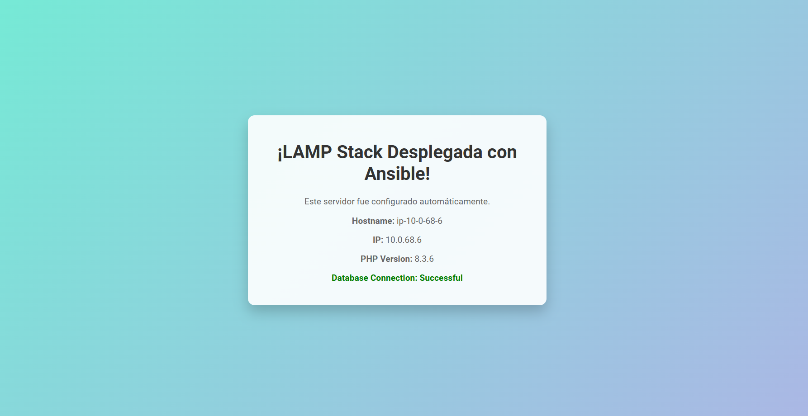

# AWS EC2 Terraform Ansible

Este repositorio contiene la automatización del despliegue y configuración de instancias EC2 en AWS utilizando **Terraform** para la infraestructura y **Ansible** para la configuración de las instancias. Además, incluye plantillas para el servidor web (PHP) que serán gestionadas por Ansible.



## Tabla de Contenidos

- [Requisitos](#requisitos)
- [Estructura del Proyecto](#estructura-del-proyecto)
- [Configuración Inicial](#configuración-inicial)
- [Exportar credenciales de AWS](#exportar-credenciales-de-aws)
- [Uso](#uso)
- [Variables](#variables)
- [Playbooks de Ansible](#playbooks-de-ansible)
- [Contribuciones](#contribuciones)

## Requisitos

Antes de comenzar, asegúrate de tener instaladas las siguientes herramientas:

- [Terraform](https://www.terraform.io/downloads.html) (versión 1.x o superior)
- [Ansible](https://docs.ansible.com/ansible/latest/installation_guide/intro_installation.html)
- [AWS CLI](https://docs.aws.amazon.com/cli/latest/userguide/install-cliv2.html) configurada con tus credenciales de AWS.

## Estructura del Proyecto

```bash
aws_ec2_terraform_ansible/
│
├── ansible/
│   ├── ansible.cfg                # Archivo de configuración de Ansible
│   ├── custom_index.html.j2       # Plantilla Jinja2 para el archivo HTML de index
│   ├── index.php.j2               # Plantilla Jinja2 para el archivo PHP de index
│   ├── playbook.yml               # Playbook de Ansible para configurar las instancias EC2
│
├── .gitattributes                 # Configuración de Git
├── .gitignore                     # Archivos y directorios ignorados por Git
├── .terraform.lock.hcl            # Bloqueo de dependencias de Terraform
├── README.md                      # Este archivo
├── inventory.tf                   # Configuración de inventario para Terraform
├── inventory.tf.tpl               # Plantilla para inventario dinámico en Terraform
├── main.tf                        # Definición de la infraestructura en AWS con Terraform
├── output.tf                      # Salidas de Terraform, posiblemente para Ansible
└── variables.tf                   # Variables usadas en Terraform
```

## Configuración Inicial

### Clonar el repositorio:

```bash
git clone https://github.com/joferte84/aws_ec2_terraform_ansible.git
cd aws_ec2_terraform_ansible
```
## Exportar credenciales de AWS

Para que esta aplicación pueda interactuar con los servicios de AWS, es necesario proporcionar las credenciales de acceso a través de variables de entorno. Las herramientas utilizadas, como **Terraform** y **Ansible**, requieren estas credenciales para autenticar las solicitudes hacia AWS y realizar tareas como el despliegue de instancias EC2.

### Configuración de las credenciales

Antes de ejecutar los comandos de Terraform o Ansible, debes asegurarte de haber exportado las siguientes variables de entorno:

```bash
export AWS_ACCESS_KEY_ID=your_access_key_id
export AWS_SECRET_ACCESS_KEY=your_secret_access_key
```

- `AWS_ACCESS_KEY_ID`: Este es el identificador de tu clave de acceso de AWS.
- `AWS_SECRET_ACCESS_KEY`: Esta es la clave secreta asociada al identificador de acceso.

Estas credenciales permiten que **Terraform** pueda desplegar la infraestructura en tu cuenta de AWS y que **Ansible** pueda configurar los servidores una vez creados.

### Nota de seguridad:

Es importante mantener estas credenciales seguras y no compartirlas públicamente, ya que otorgan acceso directo a los servicios de tu cuenta de AWS. Como buena práctica, asegúrate de utilizar mecanismos como [AWS IAM](https://docs.aws.amazon.com/IAM/latest/UserGuide/introduction.html) para otorgar permisos mínimos necesarios y rotar las claves regularmente.

## Configurar las variables de Terraform:

Edita el archivo `variables.tf` para definir tus configuraciones personalizadas como la región de AWS, el tipo de instancia EC2, la clave SSH, etc.

### Nota importante:

Recuerda que, antes de ejecutar cualquier comando de Terraform, debes haber exportado las credenciales de AWS (`AWS_ACCESS_KEY_ID` y `AWS_SECRET_ACCESS_KEY`). Es recomendable no incluir estas credenciales directamente en los archivos de configuración por motivos de seguridad. En su lugar, utiliza variables de entorno o un archivo seguro de configuración como `.env` para manejarlas.

## Configurar el inventario de Ansible:

El inventario dinámico está definido en `inventory.tftpl` y será generado automáticamente por Terraform. Asegúrate de que las instancias EC2 estén correctamente incluidas en el inventario.

## Uso

### 1. Inicializar y desplegar con Terraform:

```bash
cd terraform/
terraform init        # Inicializa el entorno de Terraform
terraform plan        # Previsualiza cambios en infraestructura
terraform apply       # Crea la infraestructura en AWS
```

## Configurar las instancias con Ansible:

Una vez que Terraform haya desplegado las instancias, usa Ansible para configurarlas.

```bash
cd ../ansible/
ansible-playbook -i hosts playbook.yml
```

Esto ejecutará las tareas de configuración definidas en el playbook de Ansible sobre las instancias EC2 creadas.

## Variables

Las principales variables definidas en `variables.tf` incluyen:

- `aws_region`: La región de AWS en la que se desplegarán las instancias.
- `instance_type`: El tipo de instancia EC2 (por ejemplo, `t2.micro`).
- `key_name`: El nombre de la clave SSH utilizada para acceder a las instancias.

Puedes agregar o modificar variables según tus necesidades.

## Playbooks de Ansible

El archivo `playbook.yml` contiene las tareas que Ansible ejecutará en las instancias EC2. Entre las tareas típicas que puedes realizar se incluyen:

- Instalación de paquetes.
- Configuración de servicios.
- Despliegue de aplicaciones.

## Contribuciones

Las contribuciones son bienvenidas. Siéntete libre de abrir un issue o enviar un pull request con mejoras o correcciones.

